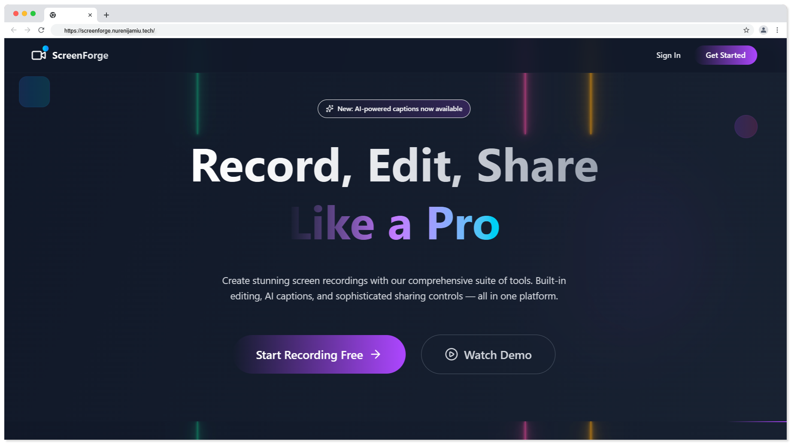

# ScreenForge 🎬

<div align="center">

[](https://screenforge.vercel.app)
[](https://opensource.org/licenses/MIT)
[](https://www.typescriptlang.org/)
[](https://reactjs.org/)
[](https://nodejs.org/)

**A comprehensive screen recording tool with built-in video editing and sophisticated sharing controls.**

*Capture, Edit, Share - All in one place*

</div>

## 🖼️ Project Preview



*ScreenForge - Professional screen recording and video editing platform*

## ✨ Features

- 🎥 **Multiple Recording Modes**: Capture entire desktop, specific windows, or browser tabs
- ✂️ **Built-in Video Editor**: Trim videos and add AI-generated captions
- 🔐 **Secure Sharing**: Flexible sharing options with download permissions
- ☁️ **Cloud Storage**: Powered by Cloudinary for reliable video hosting
- 📱 **Responsive Design**: Works seamlessly on desktop and mobile devices
- 🔒 **Authentication**: Secure user authentication with Clerk
- 🎨 **Modern UI**: Clean, intuitive interface built with Tailwind CSS

## 🚀 Quick Start

### Prerequisites

Before you begin, ensure you have the following installed:
- [Node.js](https://nodejs.org/) (v18 or higher)
- [npm](https://www.npmjs.com/) or [yarn](https://yarnpkg.com/)
- [PostgreSQL](https://www.postgresql.org/) database
- [Git](https://git-scm.com/)

### Installation

1. **Clone the repository**
   ```bash
   git clone https://github.com/NureniJamiu/screenforge.git
   cd screenforge
   ```

2. **Install dependencies**
   ```bash
   npm run install:all
   ```

3. **Set up environment variables**

   Create `.env` files in both frontend and backend directories:

   **Frontend (.env)**
   ```env
   VITE_CLERK_PUBLISHABLE_KEY=your_clerk_publishable_key

   Here are some planned features and integrations for upcoming releases:


   CLOUDINARY_CLOUD_NAME=your_cloudinary_cloud_name
   CLOUDINARY_API_KEY=your_cloudinary_api_key
   CLOUDINARY_API_SECRET=your_cloudinary_api_secret
   NODE_ENV=development
   ```

4. **Set up the database**
   ```bash
   npm run prisma:generate
   npm run prisma:migrate
   ```

5. **Start the development servers**
   ```bash
   npm run dev
   ```

   This will start:
   - **Frontend**: http://localhost:5173
   - **Backend**: http://localhost:3001

## 📁 Project Structure

```
screenforge/
├── 📁 frontend/                 # React + TypeScript frontend
│   ├── 📁 src/
│   │   ├── 📁 components/       # Reusable UI components
│   │   ├── 📁 pages/           # Page components
│   │   ├── 📁 hooks/           # Custom React hooks
│   │   ├── 📁 services/        # API services
│   │   ├── 📁 store/           # Zustand state management
│   │   ├── 📁 types/           # TypeScript type definitions
│   │   └── 📁 utils/           # Utility functions
│   ├── 📄 package.json
│   └── 📄 vite.config.ts
├── 📁 backend/                  # Node.js + Express backend
│   ├── 📁 src/
│   │   ├── 📁 controllers/     # Route controllers
│   │   ├── 📁 middleware/      # Express middleware
│   │   ├── 📁 routes/          # API routes
│   │   └── 📁 utils/           # Utility functions
│   ├── 📁 prisma/              # Database schema and migrations
│   ├── 📄 package.json
│   └── 📄 vercel.json
├── 📄 package.json             # Workspace configuration
└── 📄 README.md               # This file
```

## 🛠️ Technology Stack

### Frontend
| Technology | Description |
|------------|-------------|
| **React 18** | Modern React with hooks and concurrent features |
| **TypeScript** | Type-safe JavaScript development |
| **Vite** | Fast build tool and development server |
| **Tailwind CSS** | Utility-first CSS framework |
| **Clerk** | Authentication and user management |
| **React Router** | Client-side routing |
| **Zustand** | Lightweight state management |

### Backend
| Technology | Description |
|------------|-------------|
| **Node.js** | JavaScript runtime environment |
| **Express** | Web application framework |
| **TypeScript** | Type-safe JavaScript development |
| **PostgreSQL** | Relational database |
| **Prisma** | Next-generation ORM |
| **Cloudinary** | Cloud-based video storage and processing |
| **Clerk** | Authentication middleware |

## 📜 Available Scripts

### Root Level Scripts
```bash
npm run dev              # Start both frontend and backend in development
npm run build            # Build both applications for production
npm run install:all      # Install dependencies for all workspaces
npm run clean            # Remove all node_modules folders
npm run prisma:generate  # Generate Prisma client
npm run prisma:migrate   # Run database migrations
npm run prisma:studio    # Open Prisma Studio
```

### Frontend Scripts
```bash
cd frontend
npm run dev      # Start Vite development server
npm run build    # Build for production
npm run lint     # Run ESLint
npm run preview  # Preview production build
npm run test     # Run tests
```

### Backend Scripts
```bash
cd backend
npm run dev                    # Start with nodemon
npm run build                  # Build TypeScript
npm run start                  # Start production server
npm run prisma:generate        # Generate Prisma client
npm run prisma:migrate         # Run database migrations
npm run migrate:cloudinary     # Migrate to Cloudinary storage
```

## 🚀 Deployment

### Frontend (Vercel)
1. Connect your GitHub repository to Vercel
2. Set the build command: `npm run build:frontend`
3. Set the output directory: `frontend/dist`
4. Add environment variables in Vercel dashboard

### Backend (Vercel)
1. Deploy from the `backend` directory
2. Vercel will automatically detect the serverless function setup
3. Add environment variables in Vercel dashboard
4. Run database migrations in production

## 🔧 Configuration

### Clerk Authentication
1. Create a Clerk account at [clerk.com](https://clerk.com/)
2. Create a new application
3. Copy the publishable and secret keys to your environment files

### Cloudinary Setup
1. Create a Cloudinary account at [cloudinary.com](https://cloudinary.com/)
2. Get your cloud name, API key, and API secret
3. Add them to your backend environment file

### Database Setup
1. Create a PostgreSQL database
2. Update the `DATABASE_URL` in your backend `.env` file
3. Run migrations: `npm run prisma:migrate`

## 🤝 Contributing

We welcome contributions! Please follow these steps:

1. **Fork the repository**
2. **Create a feature branch**
   ```bash
   git checkout -b feature/amazing-feature
   ```
3. **Make your changes**
   - Follow the coding standards in `.github/copilot-instructions.md`
   - Write tests for new features
   - Ensure TypeScript types are properly defined
4. **Commit your changes**
   ```bash
   git commit -m 'Add some amazing feature'
   ```
5. **Push to the branch**
   ```bash
   git push origin feature/amazing-feature
   ```
6. **Open a Pull Request**

### Development Guidelines
- Use TypeScript strictly with proper type definitions
- Follow React functional components with hooks
- Use Tailwind CSS for styling with mobile-first approach
- Implement proper error handling and loading states
- Use Prisma Client for database operations
- Follow RESTful API design principles

## 📝 License

This project is licensed under the MIT License - see the [LICENSE](LICENSE) file for details.

## 🙏 Acknowledgments

- [Clerk](https://clerk.com/) for authentication services
- [Cloudinary](https://cloudinary.com/) for video storage and processing
- [Vercel](https://vercel.com/) for hosting and deployment
- [Prisma](https://prisma.io/) for database management

## 🔮 Future Integrations

Planned features for upcoming releases:

- **Zoom on Cursor Point:** Viewers can zoom in on specific areas of the screen recording by hovering or clicking near the cursor.
- **Comments & Reactions:** Users can leave comments or emoji reactions directly on shared videos for collaborative feedback.
- **Advanced Analytics:** Track viewer engagement, watch time, and interaction statistics for each video.
- **Third-Party Integrations:** Connect with platforms like Slack, Trello, Notion, and Google Drive for seamless sharing and workflow automation.
- **Custom Branding:** Add custom watermarks, intro/outro screens, and branding options for organizations.
- **Transcript Search:** Search within AI-generated captions and transcripts for quick navigation.
- **Live Collaboration:** Multiple users can annotate or edit videos in real-time.

## 📞 Support

If you have any questions or need help, please:
- Open an issue on GitHub
- Check the [documentation](https://github.com/NureniJamiu/screenforge/wiki)
- Contact the maintainers

---
